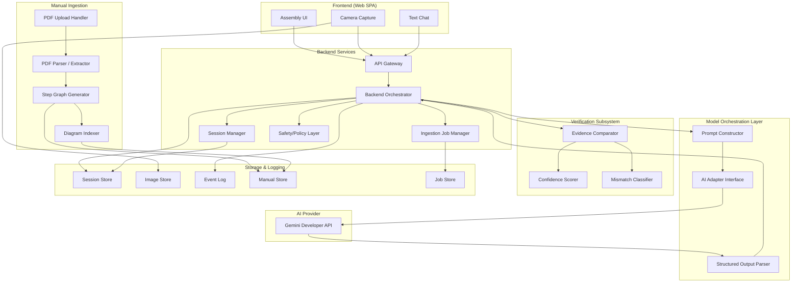
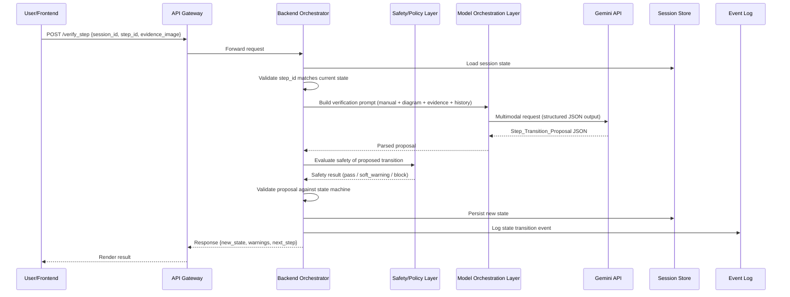
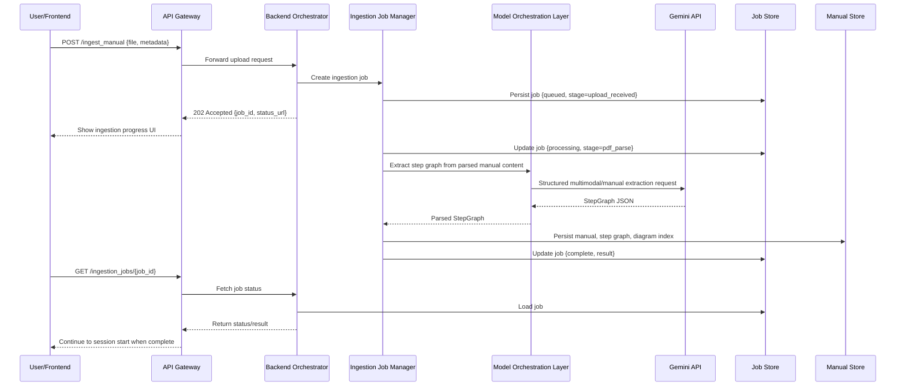
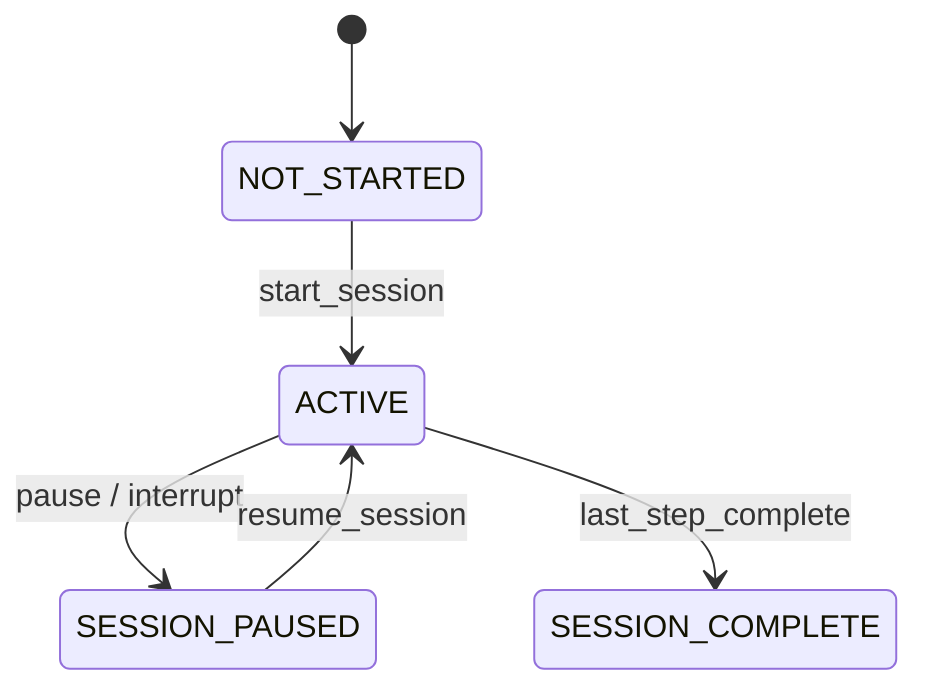
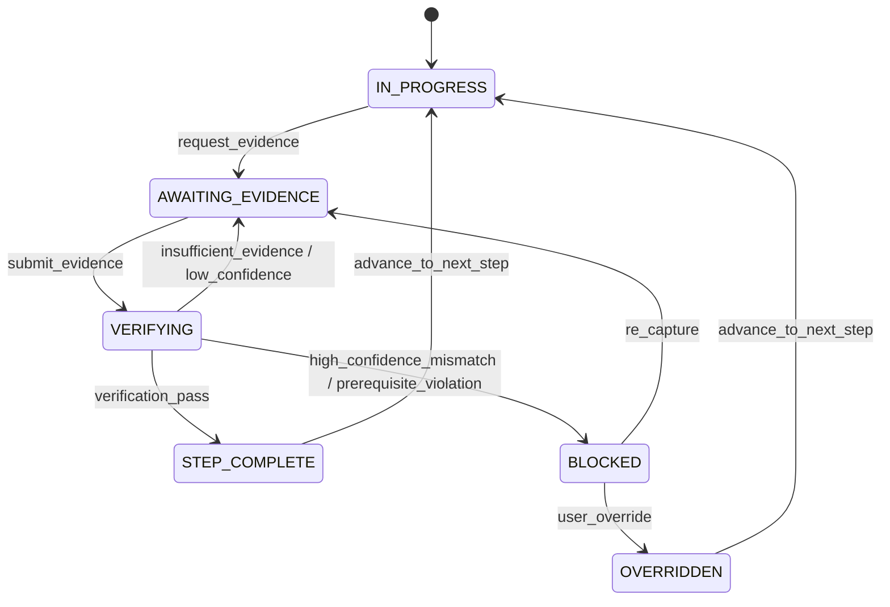

# Design Document: AI Handyman

## Overview

AI Handyman is a web-based real-time assembly copilot that transforms static flat-pack furniture manuals into interactive, step-by-step guided assembly experiences. The system ingests PDF manuals, extracts structured step graphs, and guides users through assembly using still-image evidence capture, visual verification via Gemini multimodal reasoning, and text-based Q&A — all orchestrated by a backend that owns authoritative workflow state.

### Design Goals

1. **Backend-authoritative state**: The model proposes, the backend validates. No silent step advancement.
2. **Structured contracts**: All model outputs are structured JSON; no free-form prose drives state changes.
3. **Abstracted AI provider**: Gemini Developer API accessed through a backend abstraction layer, swappable to Vertex AI.
4. **Observability-first**: Every state transition, model call, and user action is logged as a structured event for replay and debugging.
5. **Soft-warning safety**: Warnings inform but don't permanently block; blocked states require explicit user override.
6. **Testability**: Each component testable in isolation with mock dependencies.

### Key Decisions

| Decision | Choice | Rationale |
|---|---|---|
| Architecture | Standard request/response with backend orchestration (Option A) | Best fit for camera+text mode, testable, production-hardenable, avoids Live API complexity in v1 |
| Interaction mode | Still-image capture + text chat | Sufficient for furniture verification; avoids streaming complexity |
| State ownership | Backend Orchestrator | Prevents model hallucination from advancing workflow |
| AI provider | Gemini Developer API behind abstraction | Hackathon-friendly, portable to Vertex AI later |
| Safety policy | Soft warnings + blockable states with override | Furniture domain is low-risk enough for user override |
| Identity model | Anonymous resumable sessions for hackathon v1 | Avoids auth work while preserving pause/resume via opaque session resume tokens |

## Architecture

### High-Level Architecture



### Request Flow (Evidence Verification)



### Request Flow (Async Manual Ingestion)




### State Model

The design persists workflow state in two dimensions:

- `session_lifecycle_state`: whether the assembly session as a whole is not started, active, paused, or complete
- `step_workflow_state`: where the current step is within the verification loop

This avoids invalid combinations like "paused but not restorable to blocked" while preserving the externally visible state names required by the requirements. API responses may return a derived `state` for convenience:

- If `session_lifecycle_state = SESSION_PAUSED`, derived `state = SESSION_PAUSED`
- If `session_lifecycle_state = SESSION_COMPLETE`, derived `state = SESSION_COMPLETE`
- Otherwise, derived `state = step_workflow_state`

#### Session Lifecycle State



#### Step Workflow State



When a session is paused, the backend persists both state dimensions plus a `resume_snapshot` so that resuming restores the exact pre-pause step workflow state, including `BLOCKED` and any pending evidence guidance.

#### Valid Session Lifecycle Transitions

| From State | To State | Trigger | Validation |
|---|---|---|---|
| NOT_STARTED | ACTIVE | `start_session` | Session exists, step_graph loaded |
| ACTIVE | SESSION_PAUSED | `pause` | Full state serialized, resume token remains valid |
| SESSION_PAUSED | ACTIVE | `resume_session` | Full state restored from latest snapshot |
| ACTIVE | SESSION_COMPLETE | `last_step_complete` | No remaining steps |

#### Valid Step Workflow Transitions

| From State | To State | Trigger | Validation |
|---|---|---|---|
| IN_PROGRESS | AWAITING_EVIDENCE | `request_evidence` | Current step requires evidence |
| AWAITING_EVIDENCE | VERIFYING | `submit_evidence` | Evidence image received, valid format |
| VERIFYING | STEP_COMPLETE | `verification_pass` | Model confidence ≥ threshold, safety check passed |
| VERIFYING | BLOCKED | `verification_fail` | High-confidence mismatch or prerequisite violation detected |
| VERIFYING | AWAITING_EVIDENCE | `insufficient_evidence` | Model requests additional evidence or confidence is below threshold |
| BLOCKED | OVERRIDDEN | `user_override` | User explicitly confirms override |
| BLOCKED | AWAITING_EVIDENCE | `re_capture` | User chooses to re-capture evidence |
| OVERRIDDEN | IN_PROGRESS | `advance_to_next_step` | Override recorded with full context |
| STEP_COMPLETE | IN_PROGRESS | `advance_to_next_step` | Next step exists in step_graph |

## Components and Interfaces

### 1. Frontend (Web SPA)

**Responsibilities:**
- Display current assembly step with expected diagram from manual
- Capture still-image evidence via device camera (using `getUserMedia` API)
- Render mismatch reasons with side-by-side comparison (user evidence vs. expected diagram)
- Text chat interface for clarifying questions
- Session management UI (start, pause, resume, complete)
- Display soft warnings and blocked state with override option
- Show session progress (completed steps, current step, remaining steps)
- Start manual ingestion jobs and poll or subscribe to ingestion job status until completion
- Treat manual ingestion as asynchronous even when fast-path completions make it feel immediate

**Key Interfaces:**
- Consumes all Backend API endpoints (see API section below)
- Sends evidence images as multipart uploads or base64-encoded payloads
- Receives structured JSON responses for all state updates

### 2. Backend Orchestrator

**Responsibilities:**
- Owns authoritative workflow state — the single source of truth for session state
- Validates all state transitions against the state machine before applying them
- Rejects invalid transitions with structured errors
- Coordinates between Frontend, Model Orchestration Layer, Safety/Policy Layer, and Storage
- Manages session lifecycle (create, advance, pause, resume, complete)
- Manages resumable manual ingestion jobs and exposes explicit job status
- Delegates verification requests to Model Orchestration Layer
- Applies safety evaluations before committing state changes

**Interface:**

```typescript
interface BackendOrchestrator {
  // Session lifecycle
  createSession(manualId: string): Promise<Session>;
  getSession(sessionId: string): Promise<Session>;
  pauseSession(sessionId: string): Promise<Session>;
  resumeSession(sessionId: string): Promise<Session>;

  // Step workflow
  getCurrentStep(sessionId: string): Promise<StepContext>;
  fetchStepContext(sessionId: string, stepId?: string): Promise<StepContext>;
  submitEvidence(sessionId: string, stepId: string, evidence: EvidencePayload): Promise<VerificationResult>;
  overrideBlock(sessionId: string, stepId: string, confirmation: OverrideConfirmation): Promise<Session>;

  // Manual ingestion
  startManualIngestion(file: PDFFile, metadata?: ManualMetadata): Promise<IngestionJob>;
  getManualIngestionJob(jobId: string): Promise<IngestionJob>;
  resumeManualIngestion(jobId: string): Promise<IngestionJob>;

  // Q&A
  askQuestion(sessionId: string, question: string): Promise<ChatResponse>;

  // Validation (internal)
  validateTransition(currentState: SessionState, proposal: StepTransitionProposal): TransitionValidation;
}
```

### 3. Model Orchestration Layer

**Responsibilities:**
- Construct prompts by assembling: manual content, relevant diagram(s), user evidence image, conversation history, current step context
- Send multimodal requests to the AI provider via the adapter interface
- Parse structured JSON responses from the model
- Apply confidence thresholding (if confidence < threshold, request more evidence instead of proposing transition)
- Never directly mutate session state

**Interface:**

```typescript
interface ModelOrchestrationLayer {
  verifyStep(context: VerificationContext): Promise<StepTransitionProposal>;
  answerQuestion(context: QuestionContext): Promise<StructuredAnswer>;
  extractStepGraph(manual: ManualContent): Promise<StepGraph>;
  requestAdditionalEvidence(context: VerificationContext): Promise<EvidenceRequest>;
}

interface AIAdapter {
  // Provider-agnostic interface
  sendMultimodalRequest(request: AIRequest): Promise<AIResponse>;
  sendTextRequest(request: AIRequest): Promise<AIResponse>;
}

// Provider-specific implementations
class GeminiDevAPIAdapter implements AIAdapter { /* Gemini Developer API */ }
class VertexAIAdapter implements AIAdapter { /* Future: Vertex AI */ }
```

**Abstraction Boundary (Requirement 17):**

| Provider-Specific (in adapter) | Provider-Agnostic (in orchestration) |
|---|---|
| API authentication (API keys vs. service accounts) | Prompt construction and context assembly |
| Endpoint URLs and request formatting | Structured output parsing |
| Response envelope unwrapping | Confidence thresholding logic |
| Rate limiting / retry with provider-specific errors | Step_Transition_Proposal schema |
| Model version selection | Conversation history management |

### 4. Manual Ingestion Layer

**Responsibilities:**
- Accept PDF uploads and validate file format/size
- Create resumable asynchronous ingestion jobs rather than relying on a long blocking request
- Parse PDF to extract text and images
- Use Gemini (via Model Orchestration Layer) to identify assembly steps from extracted content
- Generate a structured Step_Graph with all required fields
- Build a Diagram_Index mapping diagram regions to specific steps
- Validate the generated Step_Graph for structural completeness (no orphan steps, valid prerequisite references)
- Return structured errors for low-quality manuals

**Pipeline Stages:**

```
Upload → PDF Parse → Text Extract → Diagram Extract → Step Identify → Step_Graph Assemble → Diagram_Index Generate → Quality Validate → Persist
```

**Interface:**

```typescript
interface ManualIngestionLayer {
  startIngestionJob(file: PDFFile, metadata?: ManualMetadata): Promise<IngestionJob>;
  getIngestionJob(jobId: string): Promise<IngestionJob>;
  resumeIngestionJob(jobId: string): Promise<IngestionJob>;
  getStepGraph(manualId: string): Promise<StepGraph>;
  getDiagramIndex(manualId: string): Promise<DiagramIndex>;
}
```

### 5. Verification Subsystem

**Responsibilities:**
- Compare user-submitted evidence images against expected visual cues from the manual
- Produce confidence scores for verification results
- Classify mismatches (wrong part, wrong orientation, missing part, incomplete step, etc.)
- Determine whether to request additional evidence (with specific capture guidance) or propose a transition

The Verification Subsystem is a backend-owned wrapper around Gemini-backed verification. It does not compete with the Model Orchestration Layer for ownership; it packages the verification-specific prompt, parses the structured result, and normalizes verification outputs for the Backend Orchestrator.

**Interface:**

```typescript
interface VerificationSubsystem {
  compareEvidence(
    evidence: EvidenceImage,
    expectedCues: VisualCue[],
    diagramRef: DiagramReference
  ): Promise<VerificationResult>;

  classifyMismatch(
    evidence: EvidenceImage,
    expectedCues: VisualCue[]
  ): Promise<MismatchClassification>;
}
```

### 6. Safety/Policy Layer

**Responsibilities:**
- Evaluate every proposed step transition for safety concerns before the Backend Orchestrator applies it
- Issue soft warnings for risky progressions (skipping prerequisites, low confidence, incorrect orientation)
- Determine whether a transition should be blocked (high-confidence mismatch, critical prerequisite skip)
- Never permanently prevent user from proceeding — blocked states always allow override
- Log all safety evaluations

**Unsafe Progression Criteria:**
- Skipping a step that is a prerequisite for a later structural step
- Proceeding when a mismatch is detected with high confidence
- Proceeding when evidence is insufficient to confirm correct assembly
- Proceeding when a part appears to be oriented incorrectly

**Interface:**

```typescript
interface SafetyPolicyLayer {
  evaluateTransition(
    proposal: StepTransitionProposal,
    sessionState: SessionState,
    stepGraph: StepGraph
  ): Promise<SafetyEvaluation>;
}

interface SafetyEvaluation {
  result: 'pass' | 'soft_warning' | 'block';
  warnings: Warning[];
  blockReason?: string;
  prerequisiteViolations: string[];
}
```

### 7. Storage & Event Logging

**Responsibilities:**
- Persist session state (sufficient for full resume after interruption)
- Store evidence images with references to session and step
- Log all state transitions, model requests/responses, evidence submissions, warnings, blocks, overrides, and ingestion job state changes as structured events
- Support session replay from event log
- Store manuals, step graphs, and diagram indices

**Interface:**

```typescript
interface SessionStore {
  save(session: Session): Promise<void>;
  load(sessionId: string): Promise<Session>;
  list(filters?: SessionFilters): Promise<SessionSummary[]>;
}

interface EventLog {
  append(event: StructuredEvent): Promise<void>;
  query(sessionId: string, filters?: EventFilters): Promise<StructuredEvent[]>;
  replaySession(sessionId: string): AsyncIterable<StructuredEvent>;
}

interface ImageStore {
  upload(image: Buffer, metadata: ImageMetadata): Promise<ImageReference>;
  retrieve(ref: ImageReference): Promise<Buffer>;
}

interface ManualStore {
  save(manual: ManualContent, stepGraph: StepGraph, diagramIndex: DiagramIndex): Promise<void>;
  getManual(manualId: string): Promise<ManualContent>;
  getStepGraph(manualId: string): Promise<StepGraph>;
  getDiagramIndex(manualId: string): Promise<DiagramIndex>;
}

interface JobStore {
  save(job: IngestionJob): Promise<void>;
  load(jobId: string): Promise<IngestionJob>;
  update(job: IngestionJob): Promise<void>;
}
```


## Data Models

### Core Schemas

#### Step_Graph

```json
{
  "manual_id": "string (UUID)",
  "version": "string (semver)",
  "total_steps": "integer",
  "steps": [
    {
      "step_id": "string (UUID)",
      "step_number": "integer",
      "title": "string",
      "description": "string",
      "parts_required": [
        { "part_id": "string", "name": "string", "quantity": "integer" }
      ],
      "tools_required": [
        { "tool_id": "string", "name": "string" }
      ],
      "prerequisites": ["string (step_id)"],
      "safety_notes": ["string"],
      "expected_visual_cues": [
        {
          "description": "string",
          "diagram_ref": "string (optional, reference into DiagramIndex)"
        }
      ],
      "common_errors": [
        {
          "error_type": "string",
          "description": "string",
          "visual_indicator": "string (optional)"
        }
      ],
      "completion_checks": [
        { "check_id": "string", "description": "string", "verification_type": "visual | structural | count" }
      ]
    }
  ]
}
```

#### Session_State

```json
{
  "session_id": "string (UUID)",
  "manual_id": "string (UUID)",
  "user_id": "string (optional, omitted in hackathon v1 anonymous sessions)",
  "resume_token_ref": "string (hash of opaque resume token)",
  "session_lifecycle_state": "NOT_STARTED | ACTIVE | SESSION_PAUSED | SESSION_COMPLETE",
  "step_workflow_state": "IN_PROGRESS | AWAITING_EVIDENCE | VERIFYING | STEP_COMPLETE | BLOCKED | OVERRIDDEN",
  "state": "NOT_STARTED | IN_PROGRESS | AWAITING_EVIDENCE | VERIFYING | STEP_COMPLETE | BLOCKED | OVERRIDDEN | SESSION_PAUSED | SESSION_COMPLETE (derived convenience field)",
  "current_step_id": "string (step_id)",
  "completed_steps": [
    { "step_id": "string", "completed_at": "ISO8601", "confidence_score": "number" }
  ],
  "skipped_steps": [
    { "step_id": "string", "skipped_at": "ISO8601", "reason": "string" }
  ],
  "blocked_state": {
    "is_blocked": "boolean",
    "reason": "string (optional)",
    "mismatch_classification": "string (optional)",
    "confidence_score": "number (optional)",
    "blocked_at": "ISO8601 (optional)"
  },
  "overrides": [
    {
      "step_id": "string",
      "overridden_at": "ISO8601",
      "user_confirmation": "boolean",
      "mismatch_reason": "string",
      "confidence_at_override": "number"
    }
  ],
  "evidence_history": [
    {
      "step_id": "string",
      "image_ref": "string",
      "submitted_at": "ISO8601",
      "confidence_score": "number",
      "verification_result": "pass | fail | insufficient"
    }
  ],
  "active_warnings": [
    {
      "warning_id": "string",
      "step_id": "string",
      "type": "prerequisite_skip | low_confidence | orientation | mismatch",
      "message": "string",
      "issued_at": "ISO8601"
    }
  ],
  "detected_mismatches": [
    {
      "step_id": "string",
      "mismatch_type": "wrong_part | wrong_orientation | missing_part | incomplete_step | other",
      "description": "string",
      "confidence_score": "number",
      "detected_at": "ISO8601"
    }
  ],
  "pending_evidence_request": {
    "guidance": "string (optional)",
    "focus_area": "string (optional)"
  },
  "resume_snapshot": {
    "session_lifecycle_state": "ACTIVE (optional)",
    "step_workflow_state": "IN_PROGRESS | AWAITING_EVIDENCE | VERIFYING | STEP_COMPLETE | BLOCKED | OVERRIDDEN (optional)",
    "captured_at": "ISO8601 (optional)"
  },
  "created_at": "ISO8601",
  "updated_at": "ISO8601"
}
```

#### Ingestion_Job

```json
{
  "job_id": "string (UUID)",
  "manual_id": "string (UUID, assigned on acceptance)",
  "status": "queued | processing | awaiting_retry | complete | error",
  "stage": "upload_received | pdf_parse | text_extract | diagram_extract | step_identify | step_graph_assemble | diagram_index_generate | quality_validate | persist",
  "progress_percent": "integer (0-100)",
  "attempt_count": "integer",
  "resume_cursor": {
    "last_completed_stage": "string (optional)",
    "last_processed_page": "integer (optional)"
  },
  "result": {
    "manual_id": "string (optional)",
    "step_graph_ref": "string (optional)",
    "diagram_index_ref": "string (optional)"
  },
  "errors": [
    { "code": "string", "message": "string", "affected_pages": ["integer"] }
  ],
  "created_at": "ISO8601",
  "updated_at": "ISO8601"
}
```

#### Step_Transition_Proposal

```json
{
  "proposal_id": "string (UUID)",
  "session_id": "string",
  "current_step_id": "string",
  "proposed_next_step_id": "string",
  "reason": "string",
  "confidence_score": "number (0.0 - 1.0)",
  "evidence_references": ["string (image_ref)"],
  "warnings": [
    { "type": "string", "message": "string" }
  ],
  "mismatch_detected": "boolean",
  "mismatch_details": {
    "type": "string (optional)",
    "description": "string (optional)",
    "visual_indicator": "string (optional)"
  }
}
```

#### Diagram_Index

```json
{
  "manual_id": "string (UUID)",
  "entries": [
    {
      "diagram_id": "string (UUID)",
      "step_id": "string (step_id)",
      "page_number": "integer",
      "bounding_box": { "x": "number", "y": "number", "width": "number", "height": "number" },
      "image_ref": "string (reference to cropped diagram image)",
      "description": "string (optional)"
    }
  ]
}
```

#### Structured_Event (Event Log)

```json
{
  "event_id": "string (UUID)",
  "session_id": "string (optional, absent for pre-session ingestion events)",
  "manual_id": "string (optional)",
  "correlation_id": "string",
  "timestamp": "ISO8601",
  "event_type": "state_transition | model_request | model_response | evidence_submission | warning_issued | block_applied | override_recorded | session_paused | session_resumed | ingestion_job_started | ingestion_job_updated | ingestion_job_resumed | ingestion_job_failed | ingestion_job_completed",
  "payload": {
    "from_state": "string (optional)",
    "to_state": "string (optional)",
    "step_id": "string (optional)",
    "job_id": "string (optional)",
    "job_stage": "string (optional)",
    "prompt_ref": "string (optional, reference to stored prompt)",
    "response_ref": "string (optional, reference to stored response)",
    "confidence_score": "number (optional)",
    "details": "object (optional, event-specific data)"
  }
}
```

### Public Frontend API Schemas

Only frontend-safe HTTP endpoints are exposed publicly. Model proposals and warning issuance remain internal orchestration contracts so clients cannot bypass backend validation.

#### POST /ingest_manual

Starts an asynchronous manual ingestion job. The frontend must not assume this request blocks until extraction is complete.

**Request:**
```json
{
  "file": "binary (multipart PDF upload)",
  "metadata": {
    "manufacturer": "string (optional)",
    "product_name": "string (optional)"
  }
}
```

**Response:**
```json
{
  "job_id": "string (UUID)",
  "manual_id": "string (UUID)",
  "status": "queued | processing | complete | error",
  "status_url": "string",
  "resume_url": "string",
  "step_graph": "StepGraph (optional, present only if complete)",
  "errors": [
    { "code": "string", "message": "string", "affected_pages": ["integer"] }
  ]
}
```

#### GET /ingestion_jobs/{job_id}

**Response:**
```json
{
  "job_id": "string (UUID)",
  "manual_id": "string (UUID)",
  "status": "queued | processing | awaiting_retry | complete | error",
  "stage": "upload_received | pdf_parse | text_extract | diagram_extract | step_identify | step_graph_assemble | diagram_index_generate | quality_validate | persist",
  "progress_percent": "integer",
  "result": {
    "manual_id": "string (optional)",
    "step_graph": "StepGraph (optional)",
    "diagram_index": "DiagramIndex (optional)"
  },
  "errors": [
    { "code": "string", "message": "string", "affected_pages": ["integer"] }
  ]
}
```

#### POST /ingestion_jobs/{job_id}/resume

**Response:**
```json
{
  "job_id": "string (UUID)",
  "status": "queued | processing | awaiting_retry | complete | error",
  "stage": "string",
  "progress_percent": "integer"
}
```

#### POST /sessions

Hackathon v1 uses anonymous resumable sessions. The backend returns an opaque resume token that the client stores and presents on resume calls.

**Request:**
```json
{
  "manual_id": "string (UUID)"
}
```

**Response:**
```json
{
  "session_id": "string (UUID)",
  "resume_token": "string (opaque secret)",
  "session_lifecycle_state": "NOT_STARTED | ACTIVE",
  "step_workflow_state": "IN_PROGRESS | AWAITING_EVIDENCE | VERIFYING | STEP_COMPLETE | BLOCKED | OVERRIDDEN",
  "state": "NOT_STARTED | IN_PROGRESS | AWAITING_EVIDENCE | VERIFYING | STEP_COMPLETE | BLOCKED | OVERRIDDEN"
}
```

#### GET /session/{session_id}/current_step

**Response:**
```json
{
  "session_id": "string",
  "session_lifecycle_state": "NOT_STARTED | ACTIVE | SESSION_PAUSED | SESSION_COMPLETE",
  "step_workflow_state": "IN_PROGRESS | AWAITING_EVIDENCE | VERIFYING | STEP_COMPLETE | BLOCKED | OVERRIDDEN",
  "state": "string (derived current session state)",
  "step": {
    "step_id": "string",
    "step_number": "integer",
    "title": "string",
    "description": "string",
    "parts_required": ["Part"],
    "tools_required": ["Tool"],
    "safety_notes": ["string"],
    "expected_diagram": "string (image URL or ref)",
    "completion_checks": ["CompletionCheck"]
  },
  "progress": {
    "completed": "integer",
    "total": "integer",
    "percentage": "number"
  },
  "active_warnings": ["Warning"],
  "blocked_state": "BlockedState | null"
}
```

#### GET /session/{session_id}/step_context

Returns richer context for the current step or a specific requested step without mutating workflow state.

**Query Parameters:**
```json
{
  "step_id": "string (optional)"
}
```

**Response:**
```json
{
  "session_id": "string",
  "step": "Step",
  "diagram_refs": ["string"],
  "expected_visual_cues": ["VisualCue"],
  "recent_evidence": ["EvidenceReference"],
  "conversation_context": ["ChatTurn"],
  "active_warnings": ["Warning"]
}
```

#### POST /session/{session_id}/verify_step

**Request:**
```json
{
  "step_id": "string",
  "evidence_image": "string (base64 or multipart)",
  "notes": "string (optional, user notes about the image)"
}
```

**Response:**
```json
{
  "verification_result": "pass | fail | insufficient",
  "confidence_score": "number",
  "session_lifecycle_state": "NOT_STARTED | ACTIVE | SESSION_PAUSED | SESSION_COMPLETE",
  "step_workflow_state": "IN_PROGRESS | AWAITING_EVIDENCE | VERIFYING | STEP_COMPLETE | BLOCKED | OVERRIDDEN",
  "new_state": "string (derived session state after transition)",
  "next_step": "Step | null",
  "mismatch": {
    "type": "string (optional)",
    "description": "string (optional)",
    "expected_diagram": "string (optional, image URL)"
  },
  "additional_evidence_request": {
    "guidance": "string (optional, what to capture)",
    "focus_area": "string (optional)"
  },
  "warnings": ["Warning"]
}
```

#### POST /session/{session_id}/override

**Request:**
```json
{
  "step_id": "string",
  "user_confirmation": true,
  "override_reason": "string (optional)"
}
```

**Response:**
```json
{
  "accepted": "boolean",
  "session_lifecycle_state": "NOT_STARTED | ACTIVE | SESSION_PAUSED | SESSION_COMPLETE",
  "step_workflow_state": "IN_PROGRESS | AWAITING_EVIDENCE | VERIFYING | STEP_COMPLETE | BLOCKED | OVERRIDDEN",
  "new_state": "string",
  "override_record": {
    "step_id": "string",
    "overridden_at": "ISO8601",
    "mismatch_reason": "string",
    "confidence_at_override": "number"
  }
}
```

#### POST /session/{session_id}/pause

**Request:**
```json
{
  "resume_token": "string (opaque secret)"
}
```

**Response:**
```json
{
  "session_id": "string",
  "session_lifecycle_state": "SESSION_PAUSED",
  "step_workflow_state": "string (preserved in resume snapshot)",
  "state": "SESSION_PAUSED"
}
```

#### POST /session/{session_id}/resume

**Request:**
```json
{
  "resume_token": "string (opaque secret)"
}
```

**Response:**
```json
{
  "session_id": "string",
  "session_lifecycle_state": "ACTIVE | SESSION_COMPLETE",
  "step_workflow_state": "IN_PROGRESS | AWAITING_EVIDENCE | VERIFYING | STEP_COMPLETE | BLOCKED | OVERRIDDEN",
  "state": "string (derived restored state)",
  "restored_warnings": ["Warning"],
  "restored_blocked_state": "BlockedState | null"
}
```

#### POST /session/{session_id}/ask

**Request:**
```json
{
  "question": "string",
  "context_step_id": "string (optional)"
}
```

**Response:**
```json
{
  "answer": "string",
  "source_references": [
    { "type": "manual_page | step | diagram", "ref": "string" }
  ],
  "suggested_actions": ["string (optional)"]
}
```

### Internal Orchestration Contracts

These contracts are used between backend-owned services. They are not exposed directly to the frontend.

#### Internal: propose_step_transition

**Request:**
```json
{
  "session_id": "string",
  "current_step_id": "string",
  "proposed_next_step_id": "string",
  "reason": "string",
  "confidence_score": "number",
  "evidence_references": ["string"]
}
```

**Response:**
```json
{
  "accepted": "boolean",
  "derived_state": "string",
  "rejection_reason": "string (optional)",
  "warnings": ["Warning"]
}
```

#### Internal: flag_warning

**Request:**
```json
{
  "session_id": "string",
  "step_id": "string",
  "warning_type": "prerequisite_skip | low_confidence | orientation | mismatch | other",
  "message": "string"
}
```

**Response:**
```json
{
  "warning_id": "string",
  "session_state": "string"
}
```


## Correctness Properties

*A property is a characteristic or behavior that should hold true across all valid executions of a system — essentially, a formal statement about what the system should do. Properties serve as the bridge between human-readable specifications and machine-verifiable correctness guarantees.*

### Property 1: State machine only permits valid transitions

*For any* `session_lifecycle_state`, *for any* `step_workflow_state`, and *for any* transition trigger, the state machine implementation shall either produce a valid next state tuple that matches the defined transition tables, or reject the transition. No invalid combination of lifecycle transition and step-workflow transition shall be persisted.

**Validates: Requirements 6.1**

### Property 2: Session state structural completeness

*For any* valid Session_State object, it shall contain all required fields: session_id, manual_id, resume_token_ref, session_lifecycle_state, step_workflow_state, state, current_step_id, completed_steps, skipped_steps, blocked_state, overrides, evidence_history, active_warnings, detected_mismatches, resume_snapshot, created_at, and updated_at — each with the correct type.

**Validates: Requirements 6.2**

### Property 3: State transition validation and invalid rejection

*For any* session in a given state and *for any* Step_Transition_Proposal from the model, the Backend Orchestrator shall validate the proposal against the state machine. If the proposed transition is not in the valid transitions table for the current state, the orchestrator shall reject it and return a structured error containing an error code and message. If the transition is valid, it shall be applied.

**Validates: Requirements 6.3, 6.4**

### Property 4: Session state serialization round trip

*For any* valid Session_State, serializing it to persistent storage and then deserializing it shall produce a Session_State equivalent to the original, preserving all fields including session_lifecycle_state, step_workflow_state, current_step_id, completed_steps, skipped_steps, blocked_state, overrides, evidence_history, active_warnings, detected_mismatches, pending_evidence_request, and resume_snapshot.

**Validates: Requirements 6.6, 8.6**

### Property 5: Mismatch detection transitions to BLOCKED

*For any* session in VERIFYING state, when the verification result indicates a mismatch (verification_result = "fail"), the session shall transition to BLOCKED state with a mismatch reason and confidence score populated in the blocked_state field.

**Validates: Requirements 8.3**

### Property 6: Low-confidence verification requests additional evidence

*For any* verification where the model's confidence score is below the configured threshold, the system shall not propose a step transition. Instead, it shall return an additional_evidence_request with non-empty guidance, and the session shall be in AWAITING_EVIDENCE state.

**Validates: Requirements 8.4, 9.5**

### Property 7: Override records contain full context

*For any* override of a BLOCKED step, the resulting override record shall contain: step_id, overridden_at (valid timestamp), user_confirmation (true), mismatch_reason (non-empty string matching the block reason), and confidence_at_override (the confidence score at the time of the block).

**Validates: Requirements 8.5**

### Property 8: Low-quality manual ingestion returns structured errors

*For any* malformed or low-quality PDF input (missing pages, unreadable content, corrupt file), the Manual Ingestion layer shall return a structured error response with error code, message, and affected_pages — never a partial Step_Graph without error indication.

**Validates: Requirements 10.3**

### Property 8a: Ingestion jobs are resumable and stage-aware

*For any* ingestion job that fails after at least one completed stage, resuming the job shall continue from the persisted `resume_cursor` rather than restarting from scratch, unless the failure invalidates earlier stage outputs.

**Validates: Requirements 10.4**

### Property 9: Step_Graph structural completeness

*For any* Step_Graph produced by the ingestion pipeline, all prerequisite references shall point to valid step_ids within the same graph, there shall be no orphan steps (steps unreachable from the first step via the prerequisite chain), and step_numbers shall be sequential starting from 1.

**Validates: Requirements 10.5**

### Property 10: Soft warnings do not block; blocked states prevent auto-progression

*For any* step transition that produces only soft warnings (no block), the session shall advance to the next state without entering BLOCKED. *For any* session in BLOCKED state, an automatic step advancement (without explicit user override) shall be rejected.

**Validates: Requirements 11.4**

### Property 11: Safety layer evaluates every transition

*For any* step transition that is applied by the Backend Orchestrator, a corresponding safety evaluation event shall exist in the event log with a timestamp equal to or earlier than the state transition event. No state transition shall be committed without a prior safety evaluation.

**Validates: Requirements 11.5**

### Property 12: Event log completeness

*For any* operation performed by the Backend Orchestrator (state transition, model request, model response, evidence submission, warning, block, override, ingestion job update), a corresponding structured event shall appear in the event log with a valid event_id, correlation_id, timestamp, and event_type, plus whichever of `session_id`, `manual_id`, or `job_id` is applicable to that operation. For model_request and model_response events specifically, the payload shall include prompt_ref or full prompt, and response_ref or full response.

**Validates: Requirements 15.1, 15.4**

### Property 13: Event log replay reproduces session state sequence

*For any* completed Assembly_Session, replaying the event log from start to finish shall reproduce the exact sequence of session states in the same order, with the final state matching the session's persisted final state.

**Validates: Requirements 15.2**


## Error Handling

### Error Categories

| Category | Examples | Handling Strategy |
|---|---|---|
| **Invalid State Transition** | Model proposes advancing from NOT_STARTED to STEP_COMPLETE without an active session | Reject with structured error; log event; return current valid state to frontend |
| **Manual Ingestion Failure** | Corrupt PDF, missing pages, unreadable diagrams | Return structured error with affected_pages list; never persist partial Step_Graph silently |
| **AI Provider Error** | Gemini API timeout, rate limit, 5xx error | Retry with exponential backoff (max 3 retries); if exhausted, return error to frontend with contextual message; log full error |
| **Evidence Upload Failure** | Image too large, unsupported format, upload timeout | Validate on frontend before upload; return structured error with guidance on acceptable formats/sizes |
| **Verification Ambiguity** | Model returns confidence below threshold | Do not propose transition; request additional evidence with specific capture guidance |
| **Session Not Found** | Invalid session_id, expired session | Return 404 with structured error; frontend redirects to session list |
| **Step_Graph Validation Failure** | Orphan steps, invalid prerequisite references | Reject the generated Step_Graph; return structured error to ingestion caller; do not persist |
| **Concurrent Modification** | Two requests modify same session simultaneously | Use optimistic locking on session state (version field); reject stale writes with 409 Conflict |

### Error Response Schema

All API errors follow a consistent structure:

```json
{
  "error": {
    "code": "string (machine-readable error code, e.g., INVALID_TRANSITION)",
    "message": "string (human-readable description)",
    "details": {
      "current_state": "string (optional)",
      "attempted_transition": "string (optional)",
      "affected_pages": ["integer (optional)"],
      "retry_after_ms": "integer (optional)"
    }
  }
}
```

### Retry and Resilience

- **AI Provider calls**: Retry up to 3 times with exponential backoff (1s, 2s, 4s). On exhaustion, return a user-facing error: "Verification is temporarily unavailable. Please try again."
- **Storage writes**: Retry up to 2 times. On failure, return 503 and log critical event.
- **Idempotency**: Override and evidence submission endpoints use idempotency keys to prevent duplicate processing.

### Frontend Error UX

- Invalid transitions: Display current state with explanation of why the action isn't available
- Verification errors: Show "Unable to verify — please try again" with retry button
- Ingestion errors: Show specific issues (e.g., "Pages 3-5 could not be read") with option to re-upload
- Network errors: Show offline indicator with automatic retry on reconnection

## Testing Strategy

### Dual Testing Approach

This system requires both unit tests and property-based tests for comprehensive coverage:

- **Unit tests**: Verify specific examples, edge cases, integration points, and error conditions
- **Property-based tests**: Verify universal properties across randomly generated inputs (minimum 100 iterations per property)

Both are complementary — unit tests catch concrete bugs in specific scenarios, property tests verify general correctness across the input space.

### Property-Based Testing

**Library**: [fast-check](https://github.com/dubzzz/fast-check) (TypeScript/JavaScript)

Each property test must:
- Run a minimum of 100 iterations
- Reference its design document property with a tag comment
- Use custom generators (arbitraries) for domain types (SessionState, StepGraph, StepTransitionProposal, etc.)

**Tag format**: `Feature: ai-handyman, Property {number}: {property_text}`

Each correctness property from the design document maps to a single property-based test:

| Property | Test Description | Key Generators |
|---|---|---|
| 1: State machine valid transitions | Generate random (state, trigger) pairs; verify only valid transitions produce next states | `arbitrarySessionState`, `arbitraryTrigger` |
| 2: Session state structural completeness | Generate random session states; verify all required fields present with correct types | `arbitrarySessionState` |
| 3: Transition validation and rejection | Generate random proposals against random states; verify valid ones accepted, invalid ones rejected with structured error | `arbitrarySessionState`, `arbitraryStepTransitionProposal` |
| 4: Session state serialization round trip | Generate random session states; serialize then deserialize; verify equivalence | `arbitrarySessionState` |
| 5: Mismatch → BLOCKED | Generate sessions in VERIFYING state with fail results; verify transition to BLOCKED | `arbitraryVerifyingSession`, `arbitraryMismatchResult` |
| 6: Low confidence → evidence request | Generate verification results with confidence below threshold; verify no transition proposed, guidance returned | `arbitraryLowConfidenceResult` |
| 7: Override record completeness | Generate blocked sessions and overrides; verify all required fields in override record | `arbitraryBlockedSession`, `arbitraryOverrideConfirmation` |
| 8: Malformed manual → structured error | Generate malformed PDF inputs; verify structured error returned, never partial Step_Graph | `arbitraryMalformedPDF` |
| 8a: Resumable ingestion jobs | Generate failed ingestion jobs with persisted cursors; verify resume continues from saved stage | `arbitraryFailedIngestionJob` |
| 9: Step_Graph structural completeness | Generate random step graphs; verify prerequisite validity, no orphans, sequential numbering | `arbitraryStepGraph` |
| 10: Warnings don't block; blocks prevent auto-advance | Generate transitions with warnings only vs. blocks; verify correct behavior for each | `arbitraryWarningTransition`, `arbitraryBlockedSession` |
| 11: Safety evaluation precedes every transition | Generate operation sequences; verify safety evaluation event precedes every state transition event in log | `arbitraryOperationSequence` |
| 12: Event log completeness | Generate random operations; verify corresponding structured events in log with required fields | `arbitraryOperation` |
| 13: Event log replay | Generate complete session histories; replay from log; verify state sequence matches | `arbitrarySessionHistory` |

### Unit Testing

Unit tests focus on specific examples and edge cases not covered by property tests:

**Backend Orchestrator:**
- Specific state transition sequences (happy path: `NOT_STARTED/IN_PROGRESS` → `ACTIVE/AWAITING_EVIDENCE` → `ACTIVE/VERIFYING` → `ACTIVE/STEP_COMPLETE` → `SESSION_COMPLETE/STEP_COMPLETE`)
- Edge case: override a blocked step then immediately pause
- Edge case: resume a session that was paused while in BLOCKED state
- Error case: submit evidence for a step that isn't the current step

**Manual Ingestion:**
- Specific known manual formats (IKEA-style, generic)
- Edge case: single-page manual
- Edge case: manual with no diagrams
- Edge case: resume an ingestion job from `diagram_extract` after a transient provider failure
- Error case: empty PDF, password-protected PDF

**Safety/Policy Layer:**
- Specific prerequisite skip scenarios
- Edge case: override accumulation (multiple overrides in one session)
- Warning + block interaction in same transition

**Model Orchestration Layer:**
- Prompt construction with various context sizes
- Structured output parsing for valid and malformed model responses
- Adapter interface contract tests (Gemini adapter, mock adapter)

**Verification Subsystem:**
- Known correct/incorrect evidence images against known diagrams
- Confidence score boundary cases (exactly at threshold)

### Component Isolation Testing

Each component is testable in isolation with mock dependencies:

| Component | Mock Dependencies | What to Test |
|---|---|---|
| Backend Orchestrator | Mock ModelOrchestrationLayer, Mock SessionStore, Mock EventLog, Mock SafetyPolicyLayer | State machine logic, transition validation, session lifecycle |
| Model Orchestration Layer | Mock AIAdapter | Prompt construction, response parsing, confidence thresholding |
| Safety/Policy Layer | None (pure logic) | Warning/block decisions given step graph and session state |
| Manual Ingestion | Mock AIAdapter, Mock ManualStore, Mock JobStore | Pipeline stages, resumability, validation, error handling |
| Verification Subsystem | Mock AIAdapter | Evidence comparison, mismatch classification |
| Frontend | Mock API responses | UI state rendering, user interaction flows |

### Eval Dataset Integration

The eval dataset (Requirement 12) integrates with testing as follows:
- Eval tuples (manual, image, expected_result) are used as fixtures in integration tests
- Automated eval passes run the verification pipeline against the dataset and compare results to ground-truth labels
- Regression tests flag when verification accuracy drops below established baselines
- Eval results are logged as structured events for analysis
